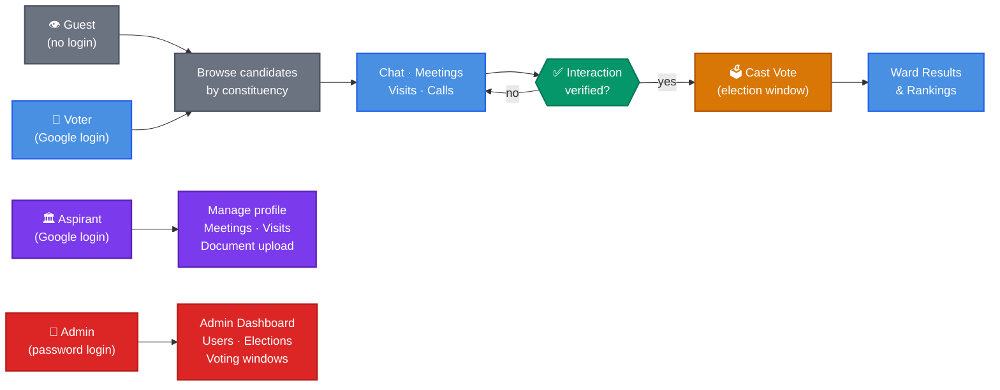

# Prajaakeeya — Frontend

> **Your Voice. Your Rule. Your Vote.** A civic platform that puts Karnataka's voters in direct conversation with their election candidates — across ward, municipal, Gram Panchayat, Assembly, and Lok Sabha elections.

[](https://github.com/prajaakeeya/prajaakeeya-frontend/actions/workflows/deploy-frontend.yml)

[](https://react.dev/)
[](https://www.typescriptlang.org/)
[](https://vitejs.dev/)
[](https://mui.com/)
[](https://www.i18next.com/)
[](https://vite-pwa-org.netlify.app/)

[](https://aws.amazon.com/amplify/)
[](https://firebase.google.com/)

---

## What Is This?

In most Indian elections, voters never speak directly to their candidates. Prajaakeeya fixes that. This repository is the **React web app** — a multi-role single-page application (also installable as a PWA) that connects voters, election candidates, and civic administrators in one platform.

**Four distinct experiences, one codebase:**

| Role | What they do |
|---|---|
| **Voter** | Register via Google, complete a constituency profile, browse candidates, chat / meet / visit, raise civic issues, cast an interaction-gated vote |
| **Aspirant** | Register as a candidate, upload documents, manage meetings and visits, engage with voter requests, track their ward standing |
| **Guest** | Browse candidates, civic issues, voter rolls, and SOP — read-only, no account required |
| **Admin** | Manage users, elections, wards, geography, voting windows, and reports from a dedicated dashboard |

**What makes it different:**
A voter cannot cast a vote until they have had a verified interaction with a candidate — chat, meeting, visit, or phone call. The vote represents informed choice, not name recognition.

---

## How It Works



---

## App Structure

```
src/
├── pages/
│   ├── guest/          # GuestDashboard, GuestAspirants, GuestCivicIssues, GuestVoters
│   ├── aspirant/       # AspirantProfile, AspirantChat, AspirantMeetingLinks, AspirantPosts, AspirantRequests
│   ├── admin/          # AdminDashboard, AdminUsers, AdminElections, AdminVotingWindow, geography pages
│   ├── UserDashboard   # Voter home — constituency overview + candidate list
│   ├── UserChat        # 1:1 voter–candidate chat
│   ├── WardCandidateList / VotingResult
│   ├── CivicIssues / ReportIssue
│   ├── Notifications
│   └── Auth flows      # AuthCallback, UserRegister, ProfileCompletion, Onboarding
├── components/         # Shared UI components
├── store/              # Zustand state (with persist)
├── api/                # Axios API client (all calls to /api/*)
├── i18n/               # English + Kannada translation files
└── locales/            # i18next locale bundles
```

---

## Tech Stack

| Area | Technology |
|---|---|
| Framework | React 18 + TypeScript |
| Build | Vite 5 |
| UI | MUI 5 + Emotion |
| Routing | React Router 6 |
| State | Zustand (with `persist`) |
| Forms | React Hook Form + Yup |
| HTTP | Axios (→ `/api/*` on the NestJS backend) |
| i18n | i18next + react-i18next (English + Kannada) |
| Animation | Framer Motion |
| PWA | vite-plugin-pwa (Workbox service worker) |
| Auth | Google OAuth 2.0 (via backend redirect flow) + Firebase config |
| Testing | Vitest + React Testing Library |
| Hosting | AWS Amplify (CDN deployment on push to `main`) |

---

## Getting Started

**Prerequisites:** Node.js 20+, npm.

```bash
git clone https://github.com/prajaakeeya/prajaakeeya-frontend
cd prajaakeeya-frontend
npm install
cp .env.example .env   # fill in VITE_API_BASE_URL + Firebase config
npm run dev            # http://localhost:5173
```

### Mock mode (no backend required)

The app has a built-in mock/API toggle for local UI development without a running backend:

```bash
VITE_APP_MODE=mock npm run dev
```

---

## Environment Variables

| Variable | Description |
|---|---|
| `VITE_API_BASE_URL` | Backend base URL (e.g. `http://localhost:3000` or `https://api.prajaakeeya.org`) |
| `VITE_FIREBASE_API_KEY` | Firebase web app config |
| `VITE_FIREBASE_AUTH_DOMAIN` | Firebase auth domain |
| `VITE_FIREBASE_PROJECT_ID` | Firebase project ID |
| `VITE_FIREBASE_MESSAGING_SENDER_ID` | FCM sender ID (for push notification permission) |
| `VITE_FIREBASE_APP_ID` | Firebase app ID |
| `VITE_GOOGLE_CLIENT_ID` | Google OAuth client ID (displayed in the login button) |

> Firebase client keys are intentionally public — they are scoped by Firebase Security Rules, not kept secret.

---

## Roles & Routes

| Role | Entry point | Key pages |
|---|---|---|
| **Guest** | `/` (no login) | `/guest`, `/guest/aspirants`, `/guest/civic-issues`, `/guest/voters` |
| **Voter** | Google OAuth → `/dashboard` | `/dashboard`, `/chat`, `/vote`, `/results`, `/issues`, `/notifications` |
| **Aspirant** | Google OAuth → aspirant profile | `/aspirant/profile`, `/aspirant/chat`, `/aspirant/meetings`, `/aspirant/requests` |
| **Admin** | Password login → `/admin` | `/admin/dashboard`, `/admin/users`, `/admin/elections`, `/admin/voting-window`, geography management |

---

## Internationalisation

Full English and **Kannada** support via i18next. The language switcher is available on every page. Translation files live in `src/locales/`.

To add a new translatable string:

```ts
// in component
const { t } = useTranslation();
return <h1>{t('home.headline')}</h1>;

// in src/locales/en.json
{ "home": { "headline": "Your Voice, Your Vote" } }

// in src/locales/kn.json
{ "home": { "headline": "ನಿಮ್ಮ ಧ್ವನಿ, ನಿಮ್ಮ ಮತ" } }
```

---

## PWA / Offline Support

The app is installable as a Progressive Web App on Android (and desktop). The Workbox service worker:

- Caches the app shell for offline loading
- Shows an "update available" banner when a new version is deployed
- Supports FCM push notifications for meeting reminders and voting window alerts (Android Chrome)

> **iOS:** Push notifications via FCM are not supported in WKWebView. iOS users receive in-app notifications only.

---

## Testing

```bash
npm test          # Vitest unit + component tests
npm run test:ui   # Vitest browser UI (interactive)
```

---

## Build & Deployment

```bash
npm run build     # production build → dist/
npm run preview   # preview the production build locally
```

Deployment is handled by **AWS Amplify**:

| Push to | Target |
|---|---|
| `staging` | Staging Amplify environment |
| `main` | Production — `prajaakeeya.org` |

Amplify picks up the build automatically on push. No manual deploy step.

---

## Scripts

| Script | Purpose |
|---|---|
| `npm run dev` | Dev server at `http://localhost:5173` with HMR |
| `npm run build` | Production build → `dist/` |
| `npm run preview` | Serve the production build locally |
| `npm test` | Run Vitest test suite |
| `npm run lint` | ESLint |
| `npm run typecheck` | `tsc --noEmit` |

---

> **Backend API:** [prajaakeeya-backend](https://github.com/prajaakeeya/prajaakeeya-backend) — NestJS + PostgreSQL + Redis
> **PWA / Mobile apps:** [prajaakeeya-pwa-apps](https://github.com/prajaakeeya/prajaakeeya-pwa-apps) — Android TWA + iOS config
